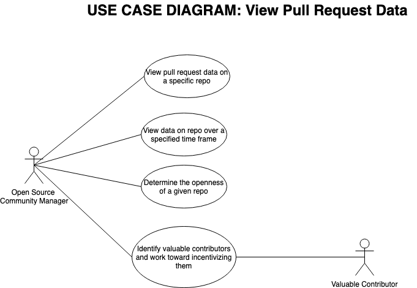

## Title
User views data regarding pull requests that are proposed and merged into project

## Description
The user, most likely an open-source community manager, will be able to view the how many pull requests have been proposed over a certain time frame, how many pull requests have been merged in a given time frame, and what the ratio of PRs proposed to PRs merged is over a specified time frame. The user will be able to specify this time frame through the UI.

The user will also be able to see the authors with the most pull requests merged, how many authors there are that could be classified as 'frequent contributors' (merged PRs > 5), the average pull requests merged by author, how many authors have had a pull request merged, and how many authors have proposed a pull request.

## Triggers
User clicks a button on UI that takes them to PR data page.

## Actors
Open-source community managers, authors who have contributed to the repo.

## Preconditions
- data for pull requests on this repo exists
- enough data exists to construct a useful visualization
- this repo has had and accepted pull requests

## Main Success Scenario (Goals)
User is able to use PR data visualization to gain insight into the openness of the open source project. For example, a project with PRs merged from many different authors is more open than a project that only merges PRs from a select few authors.

## Alternate Success Scenarios
A user is able to identify authors who have frequently contributed good code through merged pull requests and looks into rewarding that contributor or, in the case of companies with open source projects such as Twitter, offering them a full-time position.

## Failed End Condition
Data visualization is unhelpful due to a lack of available information on the repo. User is unable to gain any real insight into the openness of the project, the number and frequency of its contributors, etc.

## Steps of Execution (Requirements)
1. Retrieve relevant data from the database
2. Display data in an appealing and helpful format on page
3. Allow user to adjust parameters of data (time frame, results shown) to suit their needs.

*Use Case Diagram showing how a user could view and use data visualization of pull requests and merges*

#### This use case created by Matt and peer-reviewed by Nick
