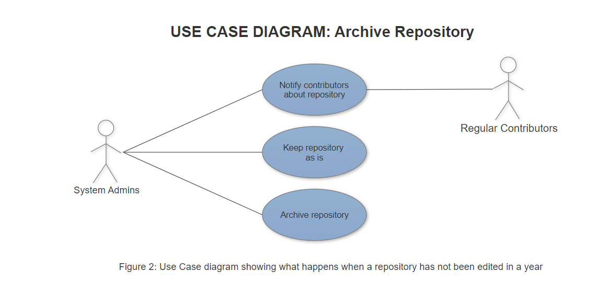

## Title
User can identify inactive repos and either archive them or direct developers to them

## Description
There are some repositories that either don’t need to be worked on anymore, or may have been forgotten about by the users. This will enable admins to either archive or boost the traffic to a specific repository.

## Triggers
User clicks 'Show Inactive Repos' page

## Actors
Open-source community managers, open source contributors

## Preconditions
Must have repositories and data about the latest commit to those repositories. Also need data about open source contributors in order to recommend inactive projects to them.

## Main Success Scenario
When a repo has gone two months without a commit, tag it as an inactive repo. When the user clicks the 'Show inactive repos' button, it takes them to a page where they can view all repos with the inactive tag. For each repo on the list, the user can either archive it or direct developers to it to possibly revive the project. If the user chooses to direct developers to the project, an email will be sent to all past contributors of the project asking them to look at it again.

## Alternate Success Scenarios
If a repo goes a full year without any commits, it will be removed from the 'inactive' list and automatically archived.

## Failed End Condition
User notifies the past contributors to the project but fails to stimulate any activity in the project

## Steps of Execution
1. User clicks the "Show Inactive Repos" button
2. User views a list of inactive repos
3. For each inactive repo, the user is able to either archive the repo or click a button to email past contributors and remind them of the project

*Use Case Diagram for Archiving or Directing Activity to Repo*

#### This use case created by Nick and peer-edited by Chuhang
