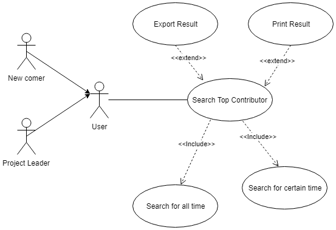

## Title:
User wants to view the top contributors by commit to a project

## Description:
User wants to see who contributes the most to a project or a repository in a certain time period by viewing the number of commits over that period. The user who contributed most commits will be considered to be the top contributor by commits in this time period.

## Triggers:
User click on 'View Top Contributors By Commit' button

## Actors:
Open-Source Community Manager  
Open Source Contributors

## Preconditions:
Commit data is loaded  
Time period selected

## Main Success Scenario:
The user sees a graph of commits over time color coded by user. The page will also list the top 5 contributors by commit over the time period. Using this data, the OSCM is able to gain insight about the project and the users who are commonly submitting commits.

## Failed End Condition:
Commit data is insufficient and the OSCM is unable to gain any good insight into project.

## Extension:
a.	No any commits in certain time period  
	i.	System return blank page with information that no commits in this time.  
b.	System fail to return data (crash)  
	ii.	Show crash page and let user to click try again button or go back to front page.  

## Steps of Execution:
1.	User chooses time period
2.	User click view contributor button
3.	System search database and filter with selected time period
4.	System return data
5. Present data in a visually appealing way for user to analyze

*Use case diagram describing how a project lead or newcomer might search for top contributors by commit to a project over all time or a specific time period*

#### This use case created by Chuhang and peer-reviewed by Matt
